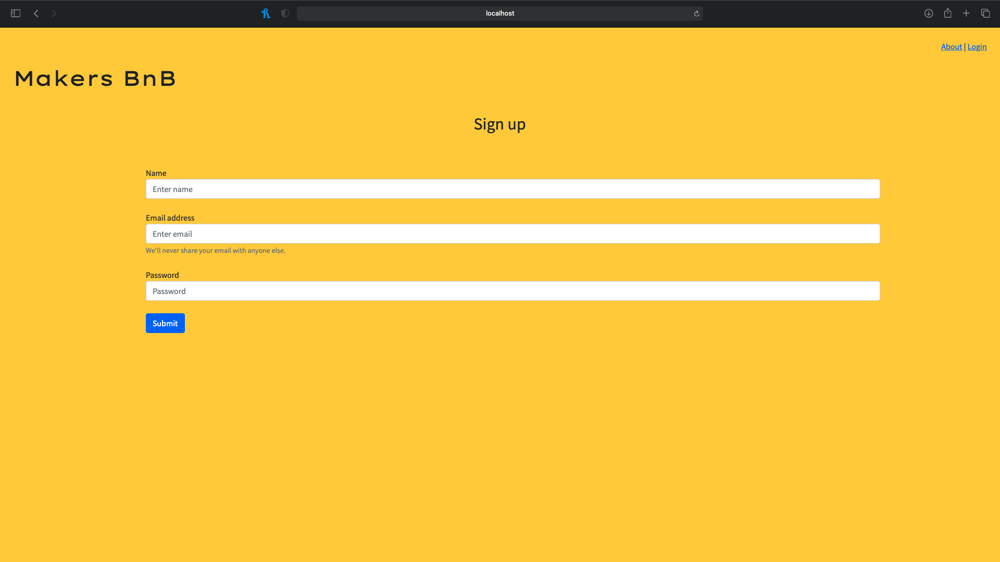
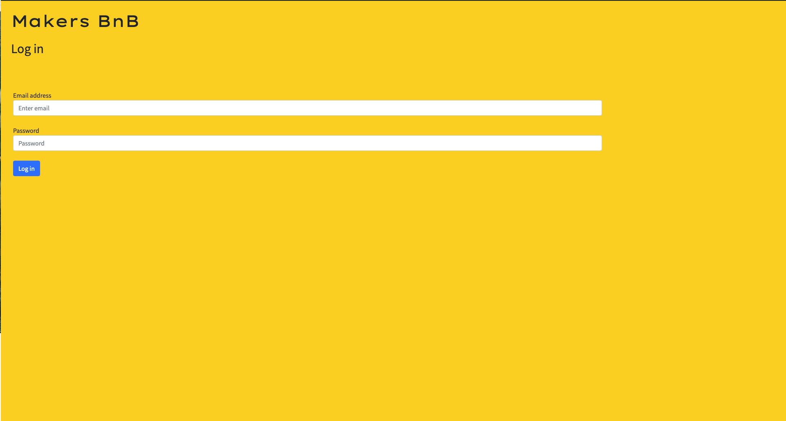
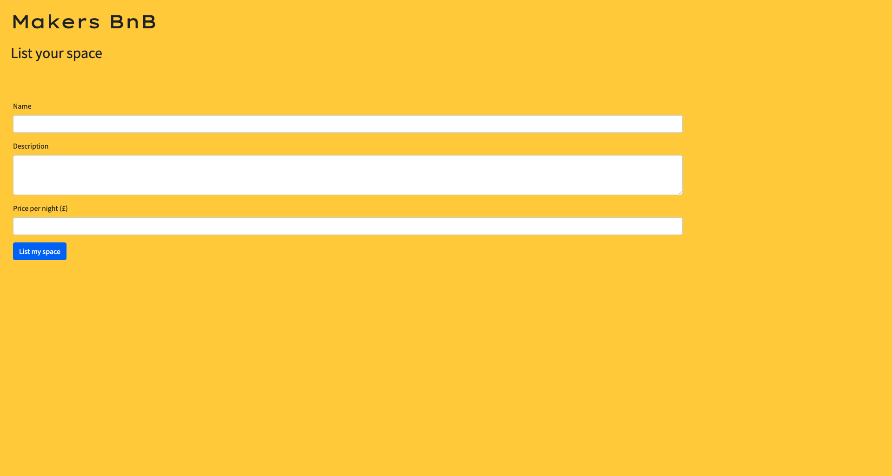

# MakersBnB

## How to use ##

#### Download repo and install packages

1. Clone repo `git clone https://github.com/GlykeriaStr/MakersBnB.git`
2. Change directory `cd makersbnb`
3. Install gems `bundle`

#### Development Database Setup

4. Connect to psql `psql`
5. Create a development database `CREATE DATABASE makersbnb;`
6. Connect to the database `\c makersbnb;`
7. Run the commands in the `db/migrations` directory
8. Create a development database `CREATE DATABASE makersbnb_test;`
9. Go back and complete steps 6 and 7 for `makersbnb_test` databese
10. Exit psql `\q`

#### Using the app

11. Run local server `rackup`
12. Open browser and head to `http://localhost:9292`

### Screenshots of the app

