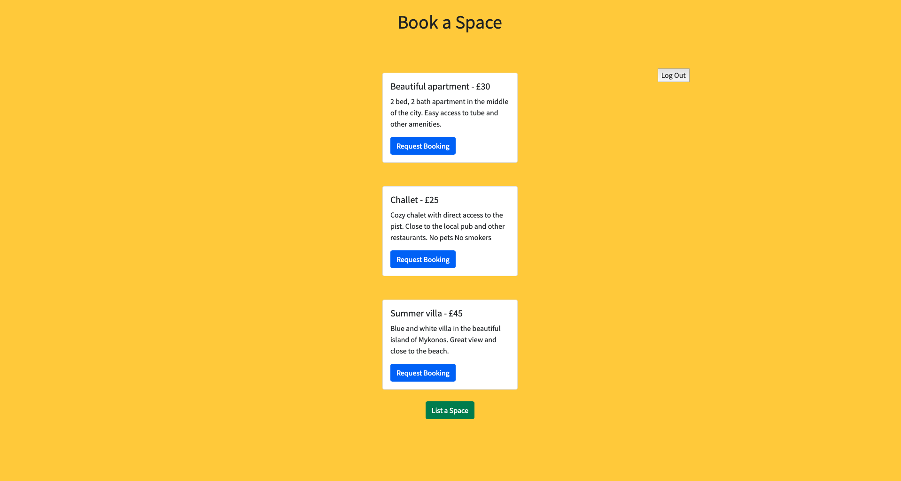

# MakersBnB

## How to use ##

#### Download repo and install packages

1. Clone repo `git clone https://github.com/GlykeriaStr/MakersBnB.git`
2. Change directory `cd makersbnb`
3. Install gems `bundle`

#### Development Database Setup

4. Connect to psql `psql`
5. Create a development database `CREATE DATABASE makersbnb;`
6. Connect to the database `\c makersbnb;`
7. Run the commands in the `db/migrations` directory
8. Exit psql `\q`

To run the tests a test database will also need to be set up.

#### Test Database Setup

9. Connect to psql `psql`
10. Create a development database `CREATE DATABASE makersbnb_test;`
11. Connect to the database `\c makersbnb_test;`
12. Run the commands in the `db/migrations` directory
13. Exit psql `\q`

#### Using the app

14. Run local server `rackup`
15. Open browser and head to `http://localhost:9292`

### Screenshots of the app

